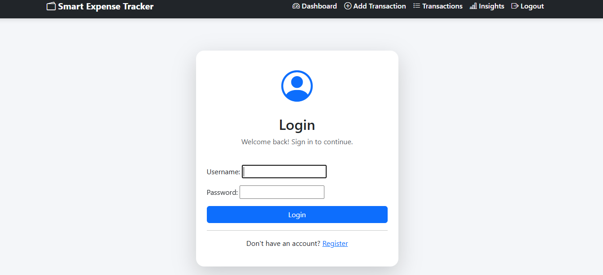
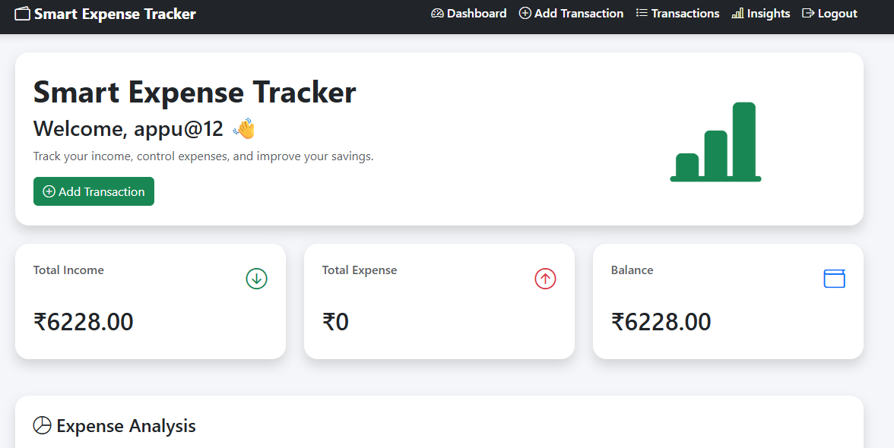
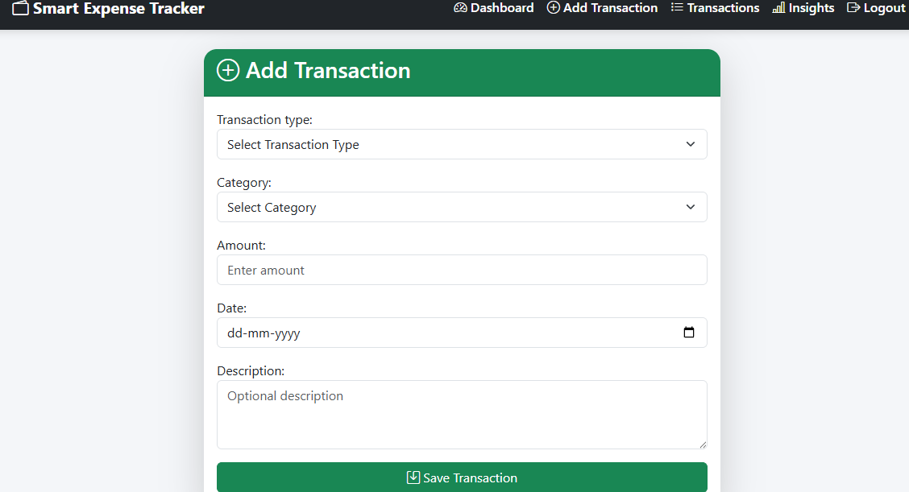
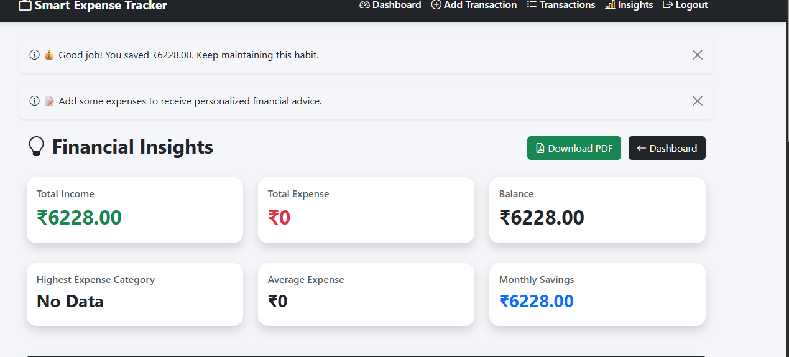
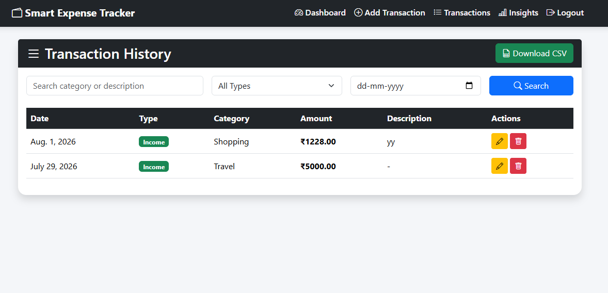

# Smart Expense Tracker

A Django-based expense management web application that helps users manage income, expenses, and view financial insights.

## Features

- User registration, login, and logout
- Secure authentication using Django authentication system
- Add income and expenses
- View transaction history
- Update and delete transactions
- Search and filter transactions
- Dashboard with income, expense, and balance summary
- Expense category analysis
- Interactive charts using Chart.js
- Generate PDF expense reports
- Responsive user interface using Bootstrap


## Technologies Used

Backend:
- Python
- Django

Frontend:
- HTML5
- CSS3
- Bootstrap 5
- JavaScript

Database:
- PostgreSQL

Libraries:
- Chart.js
- ReportLab

Deployment:
- Render

Version Control:
- Git & GitHub


## Project Structure

```
SmartExpenseTracker/

├── accounts/
│   └── User authentication and account management

├── expenses/
│   └── Income and expense management features

├── insights/
│   └── Analytics and financial insights

├── expense_tracker/
│   └── Main Django project configuration

├── manage.py
│   └── Django management script

├── requirements.txt
│   └── Project dependencies

└── README.md
    └── Project documentation
```


## Installation

Clone the repository:

```bash
git clone https://github.com/satishkumar-appu/SmartExpenseTracker.git
```

Navigate to the project folder:

```bash
cd SmartExpenseTracker
```

Create virtual environment:

```bash
python -m venv env
```

Activate virtual environment:

Windows:

```bash
env\Scripts\activate
```

Install dependencies:

```bash
pip install -r requirements.txt
```

Apply migrations:

```bash
python manage.py migrate
```

Create admin user:

```bash
python manage.py createsuperuser
```

Run the application:

```bash
python manage.py runserver
```


Open in browser:

```
http://127.0.0.1:8000/
```


## Deployment

The application is deployed using Render.

Live Demo:
## DEMO LOGIN:
USERNAME: demo
PASSWORD : demo#123

https://smartexpensetracker-pwes.onrender.com


## Screenshots

### Login Page


### Dashboard


### add_transaction


### insights


### transaction_history



## Learning Outcomes

- Django MVT architecture
- Django authentication
- CRUD operations
- Django ORM
- Database integration
- Template rendering
- Frontend and backend integration
- Deployment of Django application


## Author

Satish Kumar